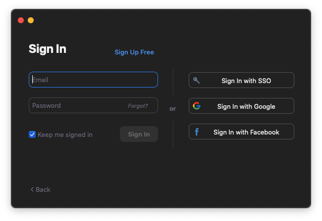
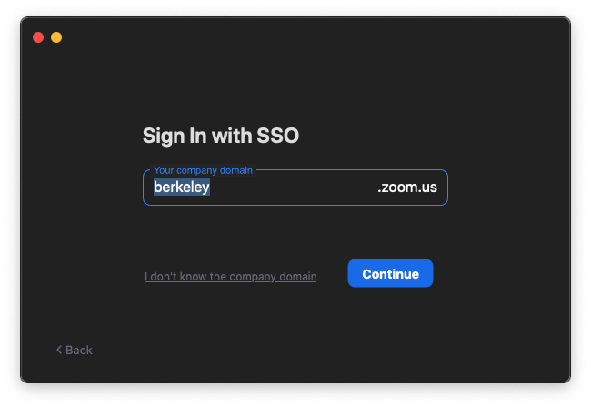

## Installation

Download the desktop application from https://zoom.us/download. The
mobile versions can be installed from Apple's App Store and Google's
Google Play.

## Upgrading

Zoom displays a notification when there is a new update within 24 hours
of logging in. You can also upgrade by downloading and installing the
latest version, the same as if you were installing it for the first
time. To [check for
updates](https://support.zoom.us/hc/en-us/articles/201362233-Where-Do-I-Download-The-Latest-Version-),
make sure you're logged into the desktop app and on Mac click the
zoom.us menu \> "Check for Updates...". On PC or Mac, click your profile
photo then click "Check for Updates...".

## Logging In

When prompted by the desktop app to login, choose the "[Sign In with
SSO](https://support.zoom.us/hc/en-us/articles/201363003-Getting-Started-with-SSO)"
option. SSO stands for "single sign-on" and will use CalNet for
authentication.

{width="50%"}

Then enter "berkeley" as the domain:

{width="50%"}

## Settings

You can configure some Zoom settings within the [desktop or mobile
applications](https://support.zoom.us/hc/en-us/articles/201362623-Changing-settings-in-the-desktop-client-or-mobile-app).
Other preferences must be set online under
https://berkeley.zoom.us/profile. Some of the settings can be
dynamically altered during the meeting, however others require that you
stop and restart the meeting.

## Profile

At https://berkeley.zoom.us/profile, if you set "Personal Link" for an
easy to remember URL for your meetings, do not use it for your courses
because it becomes an easier target for zoom bombers.

## Instructional Settings

The settings below can be changed at
<https://berkeley.zoom.us/profile/setting>, and may be most useful when
hosting course-based meetings.

### Under Settings \> Meeting \> Schedule Meeting

- Turn off "Participants video" to start meetings with participant video
  off. Participants can change this during the meeting.
- Turn on "Only authenticated users can join meetings" and "Only
  authenticated users can join meetings from Web client" to accurately
  identify participants. This prevents people without campus accounts
  from joining meetings. It is not appropriate if you are intentionally
  hosting participants who do not have campus accounts such as external
  collaborators. If you enable this, you may wish to also enable the
  equivalent option for recordings, documented below.
- Turn on "Require a password when scheduling new meetings". This can
  provide some additional security, though once the meeting password is
  shared via the Zoom invitation, there is a greater chance that it can
  be shared to those who have not been invited by you.
- Turn on "Mute participants upon entry".

### Under Settings \> Meeting \> In Meeting (Basic)

- Turn off "Play sound when participants join or leave".
- Set "Screen sharing" \> "Who can share?" to "Host Only" if you want to
  prevent all participants from sharing.
- Turn off "Allow participants to rename themselves". (as of Zoom
  4.6.10)

### Under Settings \> Recording

- Turn on "Automatic recording" if you always want to record meetings
  that you host.
- Turn on "Only authenticated users can view cloud recordings"

## Additional Resources

- [Settings for Preventing
  Zoom-Bombing](https://security.berkeley.edu/resources/cybersecurity-and-covid-19/settings-preventing-zoom-bombing) \[IST\]
- [Securing Zoom
  Recordings](https://security.berkeley.edu/resources/cybersecurity-and-covid-19/securing-zoom-recordings) \[IST\]
- [Toolkit for Creating a Healthy Virtual
  Environment](https://diversity.berkeley.edu/creating-healthy-virtual-environment-toolkit)
  \[Division of Equity and Inclusion\]
- [Zoom and
  Accessibility](https://www.ucop.edu/electronic-accessibility/web-developers/productivity-tools/accessibility-with-zoom.html)
  \[UCOP\]
