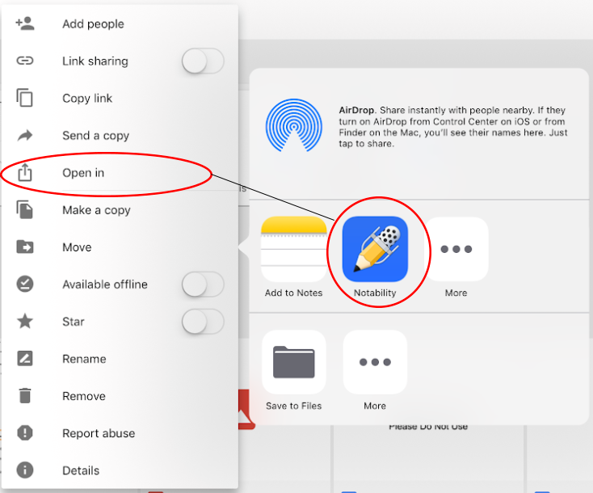
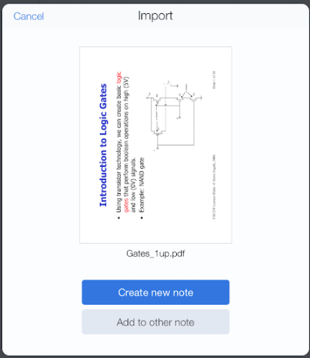

:::{important}
The iPads are a shared resource so you must not store any sensitive student
data on them such as course rosters.
:::

## Login to the iPad

Press the home button and enter the access code.

## Access WiFi

The iPad may automatically log in to eduroam using a service account. To
change the WiFi network:

1.  Open the "Settings" application.
1.  Tap "Wi-Fi". If not already on, slide the control button next to "Wi-Fi".  
    The color around the slider should be green. {width="57px" height="41px"}
1.  Choose a UC Berkeley wireless network, presumably the main
    network: eduroam.

## Apple Pencil

1.  Some apps support the Apple Pencil as a scribbling utensil, while
    others recognize it as an extension of one’s finger.
1.  You will need to [charge the
    Pencil](https://support.apple.com/en-us/HT211019) periodically.

## Annotate PDF or Doc files

1.  Open the Google Drive application and locate the document that you
    wish to open in notability.
1.  Find and tap the "..." next to the file name to invoke the options
    list on the image below.  
    {width="500px" height="416px"}
1.  Tap "Open in", and then tap Notability on the applications
    list.  Notability works best with PDF files, or documents created
    with Google Docs, Google Sheets, or Google Slides.
1.  When Notability opens, select "Create New Note".  
    {width="400px" height="463px"}
1.  If the document is multi-page, every page will be selected by
    default, You must unselect the pages that you don't need.
1.  Tap "import".  If an additional dialog with the list of imported
    files was generated, tap "done".
1.  Go to the Notability main page and select the new note.

## Authentication

Since the iPad belongs to the manager@stat.berkeley.edu Apple account,
some apps like the Apple App Store are affiliated with the account.
Other apps use a separate login. For example when using apps in the
Google suite, you can login using your bConnected account.

## Returning the iPad

- Sign out of each app, for example [Google
  Drive](https://support.google.com/drive/answer/6373157?co=GENIE.Platform%3DiOS&hl=en).
- Delete any personal files and data.
